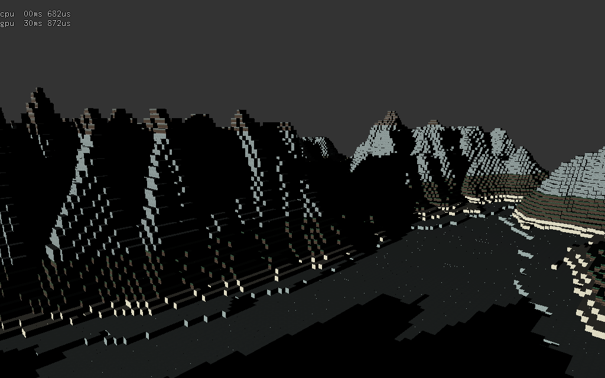

# TP Synthèse d'image
## Rapport
L'application est capable de générer un terrain de cubes façon Minecraft (le volume en moins)
à partir d'une image de hauteur. L'amplitude et la taille du terrain peuvent être paramétrés
pour être différents de celles de l'image de hauteur.

Les cubes sont instanciés, et regroupés en régions de 64x64 cubes. Cette segmentation permet
d'effectuer un test de visibilité dans le but de ne dessiner que ce qui est visible par la
caméra, c'est à dire se trouvant dans le frustum. Cela peut améliorer les performances car
réduit le nombre de draw calls. Pour éviter les trous dans le terrain, on rajoute des cubes
là où il n'y a pas de voisin un cube en dessous.

Les cubes sont texturés et le shader les surfaces diffuse et spéculaire. La méthode utilisée
est celle de Blinn-Phong. Les textures sont regroupés par trois à l'exécution: le dessus, le
dessous et les côtés. Comme il y a peu de textures, elles sont toutes bindées constamment.
La texture à appliquer au cubes est choisi dans le fragment shader en fonction de l'altitude.

Le shadow mapping est fonctionnel, il permet d'avoir les ombres des montagnes sur les autres.
Le "soleil" fait le tour du terrain en appuyant sur G.

Une caméra première personne est utilisée pour se déplacer sur le terrain.



## Dépendances
La librairie gKit2Light est requise pour compiler les exécutables. Elle est disponible [à cette adresse](https://forge.univ-lyon1.fr/Alexandre.Meyer/gkit2light).
Il faut modifier le chemin d'accès à gkit dans `premake5.lua` avant de générer les fichiers de projet avec premake.

## Build
Exécuter le script à la racine du projet suivant pour générer les fichiers de build et compiler :
```shell
premake5 gmake2 && make -C build/
```
Exécuter le programme :
```shell
./bin/TP2
```

## Executer
Appuyer sur `G` pour faire tourner le soleil.

`Z` pour avancer, `Q` et `D` pour aller à gauche et à droite respectivement.

`S` prend une capture du framebuffer et l'enregistre sur le disque.

## TODO-liste
- [x] Générer positions d'instances de cubes à partir de la Heightmap
  - [x] Segmentation par régions
    - [x] Test visibilité
      - [ ] Gestion de la mémoire (FIFO VBO)
- [x] Blinn-Phong
- [x] Textures en fonction de l'altitude/la pente
- [x] Shadow Mapping
